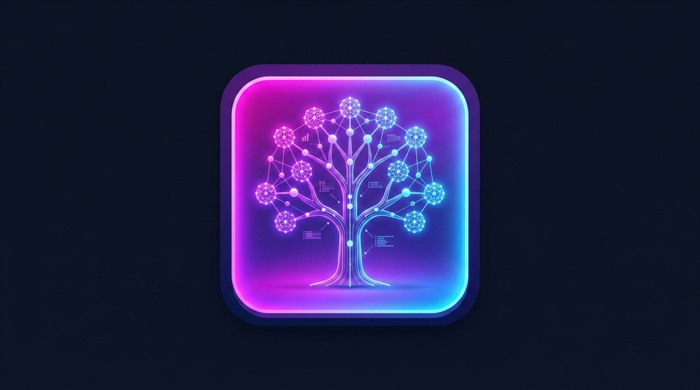
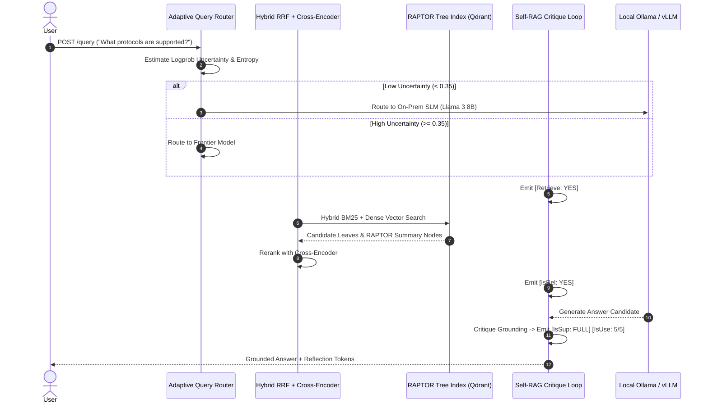

# RAPTOR Self-RAG Engine 🧠📚

<p align="center">
  
</p>

A production-grade, local-first RAG 2.0 retrieval engine that implements **RAPTOR** (Recursive Abstractive Processing for Tree-Organized Retrieval), **Self-RAG reflection control tokens**, and **adaptive model routing** using Ollama, vLLM, Qdrant, and Cross-Encoders.


---

## 🌟 Key Features

- **Hierarchical Tree Retrieval (RAPTOR):** Recursive soft-clustering and abstractive summarization tree indexing for multi-granular and holistic query answering.
- **Self-RAG Reflection Tokens:** Emits `[Retrieve: YES/NO]`, `[IsRel: YES/NO]`, `[IsSup: FULL/PARTIAL/NONE]`, and `[IsUse: 5/5|1/5]` critique tokens to self-evaluate context freshness, support, and utility.
- **Local-First Zero-Cost LLM Engine:** Native integrations with **Ollama** (`llama3`, `mistral`, `phi3`) and **vLLM** high-throughput servers alongside cloud API endpoints.
- **Adaptive Context Router:** Routes simple informational queries to local SLMs and complex multi-hop queries to frontier API models using predictive uncertainty & logprob entropy estimation.
- **Hybrid Search & Cross-Encoder Reranking:** Sparse BM25 term search + dense vector retrieval merged via Reciprocal Rank Fusion (RRF) and re-scored with joint-attention Cross-Encoders.
- **One-Command Docker Compose:** Complete stack containing **Qdrant Vector DB**, **FastAPI Gateway**, and **Interactive Web Dashboard UI**.

---

## 📊 Performance Comparison: Naive RAG vs. RAPTOR Self-RAG Engine

| Metric / Dimension | Naive RAG (Embed -> Search -> LLM) | RAPTOR Self-RAG Engine |
|---|---|---|
| **Multi-Granular Context** | ❌ Fails on multi-document overview queries | ✅ **RAPTOR Tree** retrieves leaf facts + cluster summaries |
| **Hallucination Prevention** | ❌ High risk (No grounding verification) | ✅ **Self-RAG Guardrails** (`[IsSup: FULL]`) & Fallback |
| **Retrieval Precision** | ⚠️ Cosine distance top-K | ✅ **Hybrid RRF** (BM25 + Dense) + **Cross-Encoder** Rerank |
| **Model Cost & Latency** | ❌ Single expensive LLM for all queries | ✅ **Adaptive Router** (Local Ollama/SLM for simple queries) |
| **Local / Offline Support** | ❌ Bound to cloud APIs | ✅ **100% Zero-Cost Local** via Ollama & vLLM |

---

## 🧬 System Architecture & Execution Sequence



---

## 🚀 Quickstart

### 1. Zero-Cost Local Setup with Ollama
```bash
# Pull your preferred local model
ollama pull llama3

# Set environment variable and run server
export LLM_PROVIDER=ollama
uvicorn src.api.server:app --host 0.0.0.0 --port 8000 --reload
```

### 2. One-Line Docker Compose Setup (Qdrant + API + Web UI)
```bash
docker-compose up --build
```
- **FastAPI Documentation:** [http://localhost:8000/docs](http://localhost:8000/docs)
- **Interactive Web Dashboard UI:** [http://localhost:7860](http://localhost:7860)

---

## 🧪 Interactive Benchmark Suite (Ragas / TruLens Style)

Execute the benchmark evaluation suite over your datasets:

```bash
python benchmarks/eval_rag.py
```

Output:
```text
=========================================================================
      RAPTOR Self-RAG Engine — Ragas/TruLens Benchmark Suite           
=========================================================================

Eval ID    | Precision | Recall   | Faithful | Score   | Difficulty
-------------------------------------------------------------------------
eval_001   | 1.00      | 1.00     | 1.00     | 1.00    | easy
eval_002   | 1.00      | 0.88     | 1.00     | 0.97    | complex_multi_hop
eval_003   | 0.00      | 0.00     | 1.00     | 0.25    | missing_context
-------------------------------------------------------------------------
AVERAGE    | 0.67      | 0.63     | 1.00     | 0.74    | Overall Benchmark
=========================================================================

✓ Saved detailed benchmark evaluation report to: benchmarks/benchmark_results.json
```

---

## 📄 License
MIT License. Created for enterprise-grade open-source RAG 2.0 deployment.
